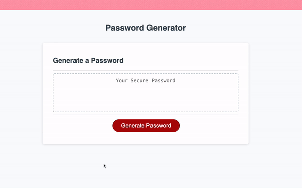

# Javascript Password Generator

## Decription
The password generator functions to produce a string of random characters through Javascript code. The character string produced is intentionally limited by the parameters defined in the script code.

The password generator operates through the use of <code>functions</code>, <code>loops</code>, and <code>variables</code> written into the script.

## Installation
To operate the Password Generator, a user must have a browser that supports Javascript and has it enabled.

## Usage
Opening the [Password Generator Webpage](https://eepitsporsche.github.io/javascript_password_generator/) and clicking the "Generate Password" button will produce a randomly generated string of characters. A series of prompts determine the parameters (password length and character types) of the password generated.

If minimum criteria is not met (a password length of between 8-128 characters and at least one character type selected), the user will recieve an alert indicating required criteria has not been met. The user can again click "Generate Password" to begin the process over and meet required criteria.

## Credits
* [dev.to](https://dev.to/code_mystery/random-password-generator-using-javascript-6a) was used to refernce how to implement a <code>for</code> loop with the <code>Math.random()</code> method.

* [mdn web docs_](https://developer.mozilla.org/en-US/docs/Web/JavaScript/Reference/Operators/Addition_assignment) was used to understand how to include selected character criteria into the generated password.

* [Code Forum](https://codeforum.org/threads/javascript-password-generator-i-need-help.6275/) was used to understand how to create an alert when character criteria is not met.

* [W3 Schools](https://www.w3schools.com/jsref/jsref_isnan_number.asp) was used to understand the <code>isNaN</code> method.

* UCB Bootcamp provided starter code for HTML structure and CSS styling of the Password Generator webpage.

## License
N/A